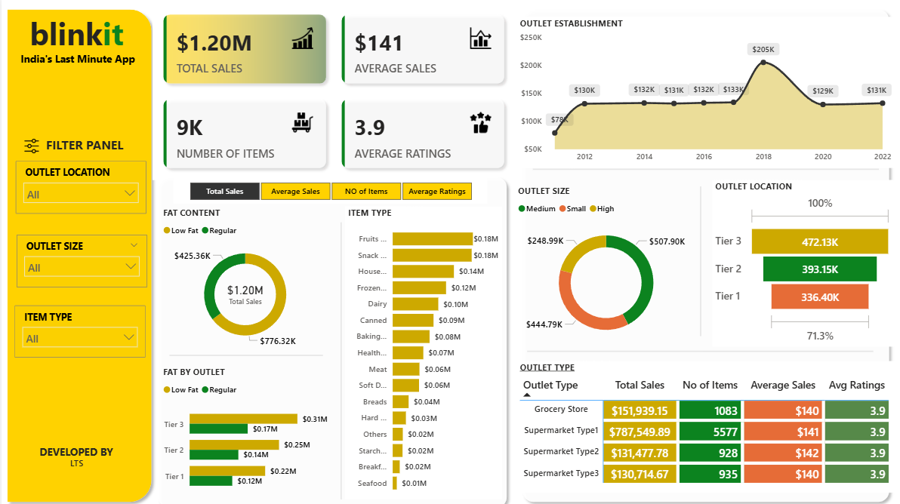

# Blinkit Capstone Project 📊



An **end-to-end data analytics project** on Blinkit using **Python, SQL, Power BI, and Excel**.  
This project covers data cleaning, analysis, and interactive dashboards to derive business insights.

---

## 🛠️ Tools & Technologies
- **Python**: NumPy, Pandas (data cleaning & EDA)
- **SQL**: Querying & business insights
- **Excel**: Pivot tables, formulas, dashboards
- **Power BI**: Interactive business dashboard

---

## 🔑 Key Insights
- Identified top-performing product categories contributing to majority of revenue.
- Found seasonal trends in sales, enabling better demand forecasting.
- Customer segmentation helped highlight high-value buyers.
- Interactive dashboards provide actionable insights for business decisions.

---

## 🚀 How to Use
1. Clone this repository:
   ```bash
   git clone https://github.com/LakshmishTS/blinkit_capstone_project.git

